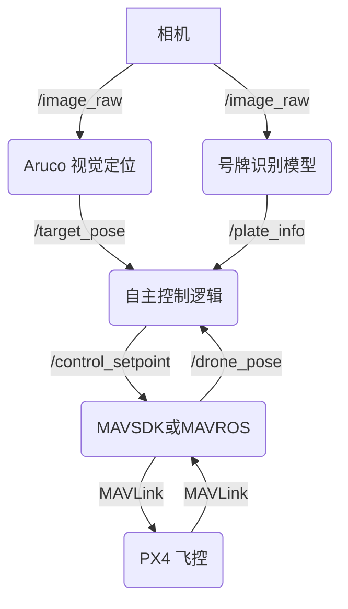

本系统采用“机载计算机 + 飞控”的异构架构。

- **机载计算机 (香橙派 ai pro)**:
    
    - 运行 [[ROS2]] 作为通信中间件。
        
    - 运行所有高计算消耗的模块，包括 [[Aruco 视觉定位]]、[[号牌识别模型]] 和 [[自主控制逻辑]]。
        
- **飞控 (Pixhawk 6C)**:
    
    - 运行 [[PX4]] 固件。
        
    - 负责底层的飞行姿态控制和任务执行。
        
- **通信链路**:
    
    - 机载计算机通过 [[MAVSDK]] (使用 `Python` 脚本) 向 [[PX4]] 发送高层指令（如 `Offboard` 模式下的设定点）。
        
    - [[ROS2]] 内部各节点通过 DDS 进行高效通信。
        

## 📈 数据流图(伪代码)

**返回: [[index]]**